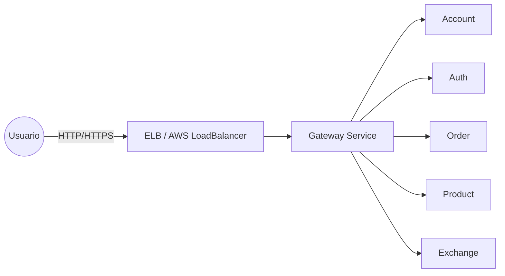
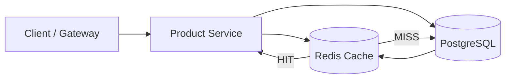
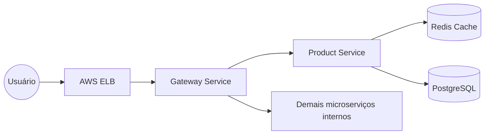

# Bottlenecks – Escalabilidade e Desempenho

Este documento consolida as estratégias de **balanceamento de carga** e **cache distribuído** utilizadas no ecossistema `store-api`, responsáveis por mitigar gargalos de desempenho e garantir **resiliência** e **alta disponibilidade** no ambiente Kubernetes da AWS (EKS).

---

## 1. Load Balancer (AWS EKS)

O **[Gateway Service](../gatewayapi/main.md)** atua como **ponto de entrada único** para todas as requisições externas ao cluster.  
Ele é configurado com um **Service Kubernetes do tipo `LoadBalancer`**, que instrui o **EKS** (Elastic Kubernetes Service) a criar automaticamente um **Elastic Load Balancer (ELB)** na AWS.

### 🔹 Fluxo de tráfego



### 🔹 Configuração do Gateway

> Para detalhes completos sobre o **deployment** e o **service** do gateway, consulte a documentação do [Gateway API](../gatewayapi/main.md).

---

## 2. Cache Distribuído (Redis)

O **[Product Service](../productapi/main.md)** utiliza o **Redis** como camada de cache distribuído, reduzindo a latência e o número de leituras diretas no banco PostgreSQL.  
O cache é implementado por meio da **abstração de cache do Spring Boot**, com gerenciamento centralizado pelo `RedisCacheManager`.

---

### 2.1 Arquitetura do cache



### 2.2 Funcionamento

| Tipo de Operação | Estratégia de Cache | TTL |
|------------------|--------------------|------|
| `findAll()`      | Cache da lista completa (`products-list`) | 2 minutos |
| `findById(id)`   | Cache individual (`product-by-id`)        | 10 minutos |
| `create()` / `delete()` | Evict automático das chaves afetadas | — |

> Para a implementação detalhada do código-fonte e das anotações `@Cacheable` / `@CacheEvict`, consulte o [Product API](../productapi/main.md).

---

## 3. Redis no Kubernetes

O Redis roda em um **Deployment dedicado**, com exposição interna via **Service ClusterIP** para consumo pelos microserviços do cluster.

### 🔹 `redis/k8s.yaml`

```yaml
apiVersion: apps/v1
kind: Deployment
metadata:
  name: redis
spec:
  replicas: 1
  selector:
    matchLabels:
      app: redis
  template:
    metadata:
      labels:
        app: redis
    spec:
      containers:
        - name: redis
          image: redis:latest
          ports:
            - containerPort: 6379
          resources:
            requests:
              memory: "64Mi"
              cpu: "50m"
            limits:
              memory: "128Mi"
              cpu: "100m"
---
apiVersion: v1
kind: Service
metadata:
  name: redis
spec:
  type: ClusterIP
  ports:
    - port: 6379
      targetPort: 6379
  selector:
    app: redis
```

> O Service `redis` é resolvido via DNS interno (`redis.store.svc.cluster.local`) e acessado pelos serviços via `spring.data.redis.host=redis`.

---

## 4. Integração com o Product-Service

O **Product Service** define as variáveis de ambiente necessárias para conectar-se ao Redis.  
O trecho abaixo mostra apenas as variáveis relevantes — o deployment completo pode ser visto na [documentação do Product API](../productapi/main.md).

```yaml
env:
  - name: SPRING_CACHE_TYPE
    value: redis
  - name: SPRING_DATA_REDIS_HOST
    value: redis
  - name: SPRING_DATA_REDIS_PORT
    value: "6379"
```

---

## 5. Benefícios Combinados

| Estratégia | Componente | Resultado |
|-------------|-------------|------------|
| **Load Balancer (ELB)** | [Gateway Service](../gatewayapi/main.md) | Alta disponibilidade e distribuição automática de tráfego |
| **Redis Cache** | [Product Service](../productapi/main.md) | Redução drástica de latência em `GET /product` e menor carga no PostgreSQL |
| **ClusterIP Services** | Todos os microserviços internos | Comunicação eficiente e segura dentro do cluster |
| **K8s Horizontal Scaling** | Gateway e serviços stateless | Escalabilidade horizontal conforme demanda |

---

## 6. Diagrama Consolidado



---

## ✅ Conclusão

A arquitetura de **Bottlenecks** integra:
- **Elastic Load Balancer (ELB)** — distribuindo o tráfego no nível de entrada com resiliência automática no EKS.  
- **Redis Cache** — otimizando leituras, reduzindo tempo de resposta e consumo de banco de dados.  
- **ClusterIP interno** — garantindo comunicação segura entre serviços, sem exposição externa desnecessária.

Essas estratégias combinadas reduzem significativamente a latência, aumentam a disponibilidade e preparam o ambiente `store-api` para escalar horizontalmente sob alta demanda.
