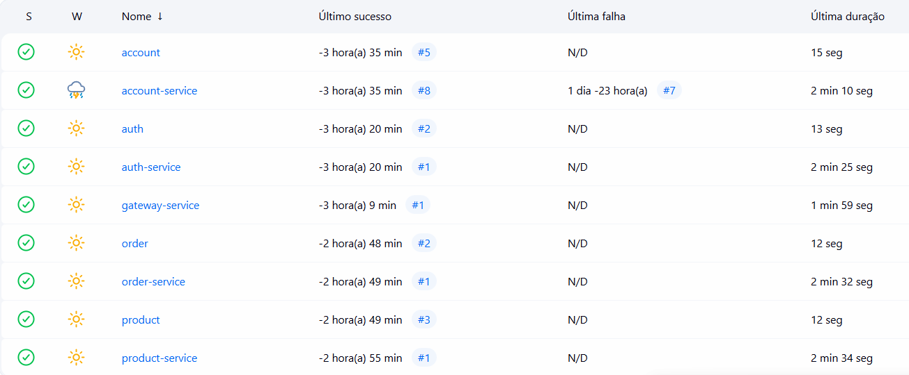
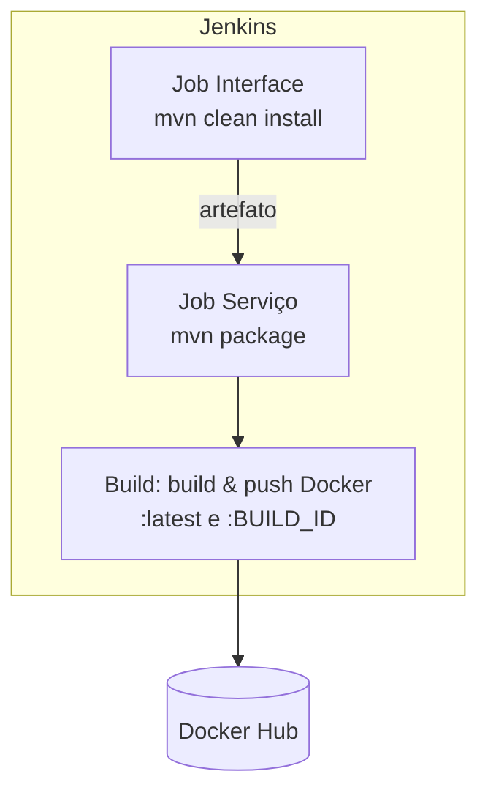
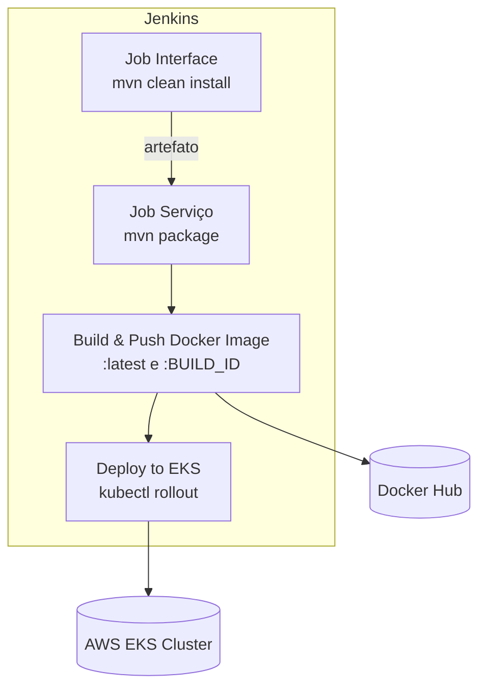

# Jenkins CI/CD – Store Project

A esteira de **CI/CD** do domínio `store` é orquestrada pelo **Jenkins**.  
Existem **três tipos de pipelines**:

1) **Interfaces** (`account`, `auth`, `product`, `order`, …)  
   - Compilam e disponibilizam artefatos Maven

2) **Serviços – Build Docker**  (`gateway-service`, `account-service`, `auth-service`, `product-service`, `order-service`, …)  
   - Compilação + publicação da imagem no Docker Hub

3) **Serviços – Build Docker + Deploy no Kubernetes (EKS)**  (`gateway-service`, `account-service`, `auth-service`, `product-service`, `order-service`, …)  
   - Após o push da imagem, o Jenkins **atualiza o Deployment** no cluster AWS EKS

---

## Status atual dos pipelines

A captura abaixo mostra o painel do Jenkins com os últimos runs de todas as pipelines ativas:



---

## Padrões de pipeline

### 1) Interfaces – apenas build Maven

```groovy
pipeline {
    agent any

    stages {
        stage('Build') {
            steps {
                sh 'mvn -B -DskipTests clean install'
            }
        }
    }
}
```

**Objetivo:** disponibilizar artefatos (JARs) para que os serviços possam compilar contra as últimas mudanças de contrato/DTOs.

---

### 2) Serviços – build, dependências e imagem Docker

```groovy
pipeline {
    agent any
    environment {
        SERVICE = <nome_serviço>            // nome lógico do serviço
        NAME = "<conta_dockerhub>/${env.SERVICE}"   // repositório de imagem no Docker Hub
    }
    stages {
        stage('Dependecies') {
            steps {
                // dispara o job da interface correspondente e aguarda concluir
                build job: <nome_interface>, wait: true
            }
        }
        stage('Build') { 
            steps {
                sh 'mvn -B -DskipTests clean package'
            }
        }      
        stage('Build & Push Image') {
            steps {
                withCredentials([usernamePassword(
                    credentialsId: 'dockerhub-credential',
                    usernameVariable: 'USERNAME',
                    passwordVariable: 'TOKEN')]) {
                    sh "docker login -u $USERNAME -p $TOKEN"

                    // builder multi-arch efêmero
                    sh "docker buildx create --use --platform=linux/arm64,linux/amd64 --node multi-platform-builder-${env.SERVICE} --name multi-platform-builder-${env.SERVICE}"

                    // build + push tags :latest e :BUILD_ID
                    sh "docker buildx build --platform=linux/arm64,linux/amd64 --push --tag ${env.NAME}:latest --tag ${env.NAME}:${env.BUILD_ID} -f DockerFile ."

                    // limpeza do builder
                    sh "docker buildx rm --force multi-platform-builder-${env.SERVICE}"
                }
            }
        }
    }
}
```

**Objetivo:** gerar imagem Docker pronta para deploy (multi-arch), com versionamento por `BUILD_ID` e tag `latest`.

---

### 3) Serviços – build, dependências e imagem Docker e Deploy Kubernetes

```groovy
pipeline {
    agent any
    environment {
        SERVICE = <nome_serviço>            // nome lógico do serviço
        NAME = "<conta_dockerhub>/${env.SERVICE}"   // repositório de imagem no Docker Hub
        AWS_REGION  = <região>       // sua região
        EKS_CLUSTER = <nome_cluster>           // nome do cluster EKS
    }
    stages {
        stage('Dependecies') {
            steps {
                // dispara o job da interface correspondente e aguarda concluir
                build job: <nome_interface>, wait: true
            }
        }
        stage('Build') { 
            steps {
                sh 'mvn -B -DskipTests clean package'
            }
        }      
        stage('Build & Push Image') {
            steps {
                withCredentials([usernamePassword(
                    credentialsId: 'dockerhub-credential',
                    usernameVariable: 'USERNAME',
                    passwordVariable: 'TOKEN')]) {
                    sh "docker login -u $USERNAME -p $TOKEN"

                    // builder multi-arch efêmero
                    sh "docker buildx create --use --platform=linux/arm64,linux/amd64 --node multi-platform-builder-${env.SERVICE} --name multi-platform-builder-${env.SERVICE}"

                    // build + push tags :latest e :BUILD_ID
                    sh "docker buildx build --platform=linux/arm64,linux/amd64 --push --tag ${env.NAME}:latest --tag ${env.NAME}:${env.BUILD_ID} -f DockerFile ."

                    // limpeza do builder
                    sh "docker buildx rm --force multi-platform-builder-${env.SERVICE}"
                }
            }
        }
        stage('Deploy to EKS') {
            steps {
                // Usa credenciais AWS do Jenkins (Access Key / Secret)
                withCredentials([[$class: 'AmazonWebServicesCredentialsBinding',
                credentialsId: 'aws-credential',
                accessKeyVariable: 'AWS_ACCESS_KEY_ID',
                secretKeyVariable: 'AWS_SECRET_ACCESS_KEY']]) {
                sh """
                    # garante diretório padrão do kubeconfig
                    mkdir -p ~/.kube

                    # configura contexto do cluster no caminho padrão (~/.kube/config)
                    aws eks update-kubeconfig --region ${AWS_REGION} --name ${EKS_CLUSTER}

                    kubectl config current-context

                    # aplica manifest inicial se ainda não existir
                    if ! kubectl get deploy ${SERVICE} >/dev/null 2>&1; then
                    kubectl apply -f ./k8s/k8s.yaml
                    fi

                    # atualiza a imagem do Deployment
                    kubectl set image deploy/${SERVICE} ${SERVICE}=${NAME}:${BUILD_ID} --record

                    # espera o rollout
                    kubectl rollout status deployment/${SERVICE} --timeout=180s
                """
                }
            }
        }
    }
}
```

**Objetivo:** gerar imagem Docker pronta para deploy (multi-arch), com versionamento por `BUILD_ID` e tag `latest`, e fazer deploy dessa imagem na AWS usando o Kubernetes EKS.

---

## Fluxo resumido

### Fkuxo resumido sem Deploy



### Fkuxo resumido com Deploy



---

## Localização dos Jenkinsfiles

Os `Jenkinsfile` de cada componente estão **nas documentações das respectivas APIs**:

| Componente         | Documentação                                       |
|--------------------|----------------------------------------------------|
| Account (interface)| [Account API](../accountapi/main.md)               |
| Account-Service    | [Account API](../accountapi/main.md)               |
| Auth (interface)   | [Auth API](../authapi/main.md)                     |
| Auth-Service       | [Auth API](../authapi/main.md)                     |
| Gateway-Service    | [Gateway API](../gatewayapi/main.md)               |
| Product (interface)| [Product API](../productapi/main.md)               |
| Product-Service    | [Product API](../productapi/main.md)               |
| Order (interface)  | [Order API](../orderapi/main.md)                   |
| Order-Service      | [Order API](../orderapi/main.md)                   |

> Cada página detalha o `Jenkinsfile` correspondente via bloco **Source**.

---

## Notas operacionais

- **Credenciais**: o push de imagens usa o secret `dockerhub-credential` (usuário/senha).  
- **Multi-arch**: as imagens são publicadas para `linux/amd64` e `linux/arm64` via `buildx`.  
- **Dependências**: serviços disparam o job da interface para garantir que compilam contra a versão mais recente dos contratos.
- **Deploy contínuo**: serviços utilizam o stage `Deploy to EKS`
- **Autenticação AWS no Jenkins** via credencial `aws-credential` (Access Key / Secret)
- **kubectl** utiliza kubeconfig configurado automaticamente:
  ```bash
  aws eks update-kubeconfig --region <região> --name <cluster>
  ```  

---

✅ *Este documento confirma que todos os pipelines necessários estão configurados e operando conforme o desenho do projeto:*
- Interfaces → compilam artefatos Maven  
- Serviços → geram e publicam imagens Docker  
- Deploy automatizado → Jenkins atualiza os Deployments no EKS após cada build da branch `main`  
