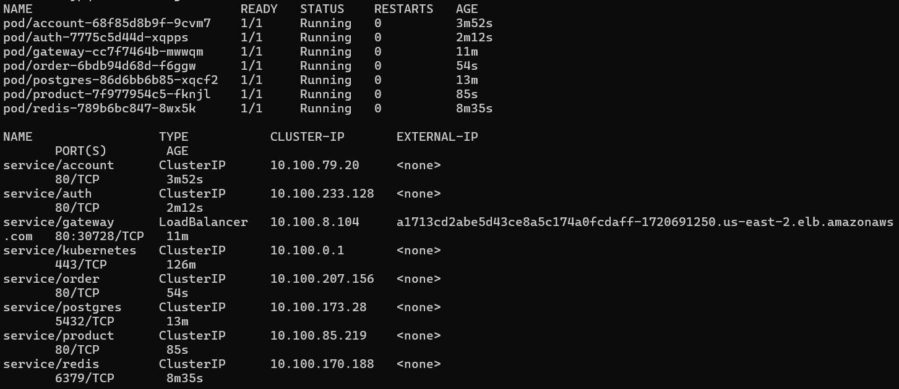
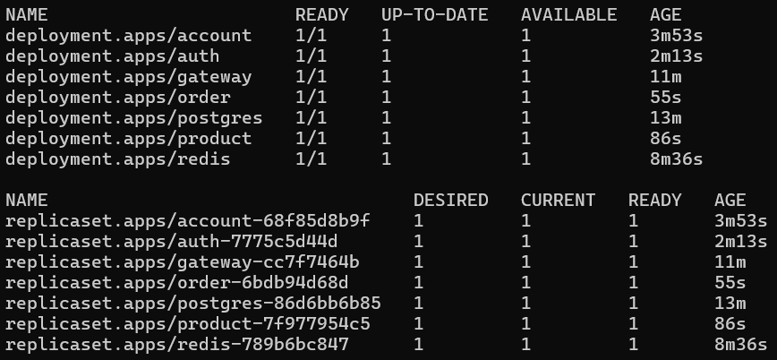
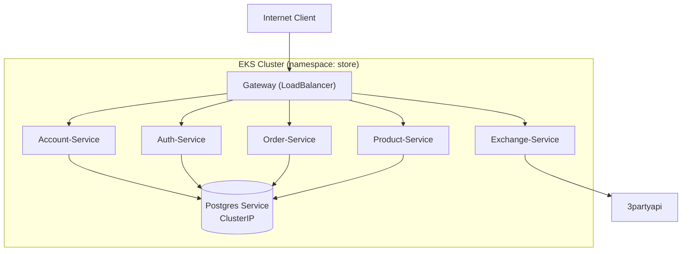

# Kubernetes Deployment – Store Project

O ambiente **Kubernetes (K8s)** é responsável por **orquestrar, escalar e manter os microserviços** do projeto em execução contínua e resiliente.  
Os manifests seguem um padrão único de **modularização**, dividindo os componentes de **banco de dados**, **serviços de aplicação** e **gateway de entrada**.

---

## Estrutura e Padrão de Deploy

A infraestrutura do `store` é organizada em **múltiplos deployments e services**, um para cada componente do sistema.

1) **Banco de dados (PostgreSQL)**  
   - Mantido em um único Deployment.  
   - Configuração via **ConfigMap** e **Secret**.  
   - Exposto internamente por `ClusterIP`.  

2) **Serviços de domínio** (`account-service`, `auth-service`, `product-service`, `order-service`)  
   - Deployments independentes.  
   - Cada um exposto via `Service` tipo `ClusterIP`.  
   - Comunicação via DNS interno do cluster (`service-name.namespace.svc.cluster.local`).  

3) **Gateway-Service**  
   - Exposto via **LoadBalancer** (AWS NLB ou ALB).  
   - Responsável por receber tráfego externo e redirecionar requisições internas.

---

## Status atual no EKS

As capturas abaixo mostram o painel do EKS com os status de todos os deploys dos serviços atuais:




---

## Diagrama Geral



---

## Localização dos manifests

Todos os arquivos de configuração do Kubernetes estão organizados por serviço, dentro da pasta `k8s` de cada módulo:

| Componente         | Documentação                                       |
|--------------------|----------------------------------------------------|
| Account-Service    | [Account API](../accountapi/main.md)               |
| Auth-Service       | [Auth API](../authapi/main.md)                     |
| Gateway-Service    | [Gateway API](../gatewayapi/main.md)               |
| Product-Service    | [Product API](../productapi/main.md)               |
| Order-Service      | [Order API](../orderapi/main.md)                   |

---

## 🛠️ Deploy no Kubernetes – Comandos Utilizados

O deploy no cluster Kubernetes é feito aplicando os manifests localizados na pasta `k8s` de cada serviço dentro do diretório `api/`.

Os comandos seguem o padrão abaixo 👇

---

### 🗄️ 1️⃣ Banco de Dados – PostgreSQL

Executar os manifests **na ordem correta**:

```bash
# Secrets (credenciais de acesso)
kubectl apply -f ./k8s/secrets.yaml
kubectl get secrets

# ConfigMap (nome do banco)
kubectl apply -f ./k8s/configmap.yaml
kubectl get configmap

# Deployment e Pod
kubectl apply -f ./k8s/deployment.yaml
kubectl get deployments
kubectl get pods

# Serviço interno (ClusterIP)
kubectl apply -f ./k8s/service.yaml
kubectl get services
```

### 🧩 2️⃣ Todos os demais serviços

(account-service, auth-service, product-service,
order-service, redis-service e gateway-service)

```bash
kubectl apply -f ./k8s/k8s.yaml
kubectl get deployments
kubectl get pods
kubectl get services
```

### Verificar os status dos serviços

```bash
kubectl get all
```

---

## Notas operacionais

- **Namespace:** `store` (pode ser criado via `kubectl create ns store`).  
- **Banco de dados:** volume persistente opcional a ser configurado no futuro.  
- **Gateway:** exposto publicamente via **AWS Load Balancer** (NLB por padrão).  
- **Rede interna:** comunicação entre microserviços via DNS do cluster (`service-name`).  
- **Ambiente:** compatível com **EKS**, **Minikube**, ou **Kind** (ambiente local).  

---

✅ *Este documento confirma que todos os manifests Kubernetes necessários estão padronizados, versionados e prontos para deploy no cluster AWS EKS, garantindo isolamento por serviço e integração completa via o Gateway.*
